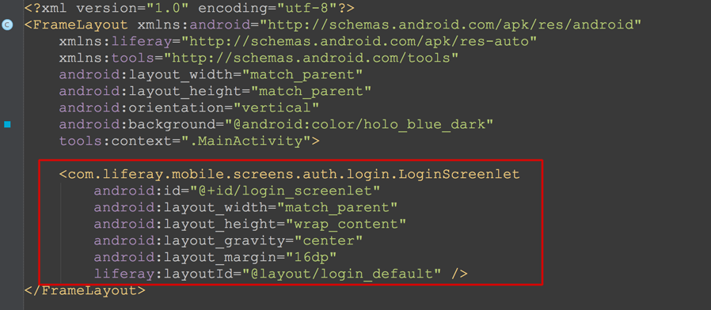

# Liferay Screens for Android

## Important Note

*This product is under heavy development and its features aren't ready for use in production. It's being made public only to allow developers to preview the technology*.

## Introduction

Liferay Screens for Android includes the component (*screenlets*) library and a sample project. In Liferay Screens, a screenlet is a visual component that is connected to Liferay Portal's functionality. Screenlets use a specific UI to handle input from the user and present information from the portal. This enables the app to receive user input, handle communication with the server, and present the user with the results.

Each screenlet is tied to one or more of [Liferay's remote services](https://www.liferay.com/documentation/liferay-portal/6.2/development/-/ai/accessing-services-remotely-liferay-portal-6-2-dev-guide-05-en). When the screenlet needs to show information to the user, it relies on a *view*. View sets can be contributed by third parties and are fully pluggable, so you aren't limited to one specific look and feel. The Screens library provides the standard *Default* view set and the sample *Material* view set.


To learn about the architecture of Screens for Android, see the [library documentation page.](library/README.md).

## Requirements

Development of Android apps using Liferay Screens requires the following: 

- Android Studio 1.0.2 or above
- Android SDK 4.0 (API Level 14) or above
- [Liferay Portal 6.2 CE or EE](http://www.liferay.com/downloads/liferay-portal/available-releases)
- [Liferay Screens' compatiblity plugin](https://github.com/liferay/liferay-screens/tree/master/portal). 
- Liferay Screens' source code

## Compatibility

Liferay Screens for Android is compatible with Android 4.0 (API Level 14) and higher.

The SDK uses [AppCompat library](https://developer.android.com/tools/support-library/features.html#v7-appcompat) (v7:21.0.3) to offer a material look that gracefully degrades in older devices and the new [recycler view](https://developer.android.com/tools/support-library/features.html#v7-recyclerview) implementation.

Other internal dependencies are [EventBus](https://github.com/greenrobot/EventBus) and [Picasso](http://square.github.io/picasso/).

## Preparing Your Project for Liferay Screens

Liferay Screens is released as an [AAR file](http://tools.android.com/tech-docs/new-build-system/aar-format), currently self-hosted in github and, in the future, in the Maven Central repository.

It is strongly recommended to use Maven or Gradle to set and download your dependencies.

#### Gradle

Use the following steps to configure your project with Gradle:

1. Add jcenter to your repositories:

	```groovy
	repositories {
		jcenter()
	}
	```

2. Include the SDK as a dependency

	```groovy
	dependencies {
		compile 'com.liferay.mobile:liferay-screens:0.3.0'
	}
	```

3. Gradle will download all the necessary dependencies before building your project.

If you get errors such as `Duplicate files copied in APK META-INF/NOTICE` when building with Gradle, add this to your `build.gradle` file:

```groovy
android {
	...
	packagingOptions {	
		exclude 'META-INF/LICENSE'
		exclude 'META-INF/NOTICE'
	}
	...
}
```

#### Maven

You can do the same as the Gradle configuration:

1. Add to your pom.xml the new dependency:

	```xml
	<dependency>
	    <groupId>com.liferay.mobile</groupId>
	    <artifactId>liferay-screens</artifactId>
	    <version>LATEST</version>
	</dependency>
	```

2. Force a Maven update to download all the dependencies.

* If maven can't locate the artifact you will have to add jcenter as a new repository in your maven settings (.m2/settings.xml)


	```xml
	<profiles>
		<profile>
			<repositories>
				<repository>
					<id>bintray-liferay-liferay-mobile</id>
					<name>bintray</name>
					<url>http://dl.bintray.com/liferay/liferay-mobile</url>
				</repository>
			</repositories>
			<pluginRepositories>
				<pluginRepository>
					<id>bintray-liferay-liferay-mobile</id>
					<name>bintray-plugins</name>
					<url>http://dl.bintray.com/liferay/liferay-mobile</url>
				</pluginRepository>
			</pluginRepositories>
			<id>bintray</id>
		</profile>
	</profiles>
	<activeProfiles>
		<activeProfile>bintray</activeProfile>
	</activeProfiles>
	```

#### Manually

You can also manually use the SDK sources if you are using gradle:

1. [Download](https://github.com/liferay/liferay-screens/releases) the
latest version of `Liferay Screens for Android`.

2. Copy the contents of `Android/library` in a folder next to your project.

3. Configure a settings.gradle in your project with the paths to the library folders:

	```groovy
	include ':core'
	include ':themes'
	project(':core').projectDir = new File(settingsDir, '../../library/core')
	project(':themes').projectDir = new File(settingsDir, '../../library/themes')
	```

4. Include the required dependencies in your build.gradle:

	```groovy
	compile project (':core')
	compile project (':themes')
	```
	
* You can also configure the .aar binary files (in `Android/dist`) as local .aar dependencies.

Great! Your project should now be ready for Liferay Screens. Next, you'll learn how to use screenlets in your app.

## Using Screenlets

Now that your project is configured to use Screens, you can start using screenlets. First, insert a screenlet in your activity or fragment layout. You can do this in XML or with the visual layout editor in Android Studio.



Next, set the screenlet's attributes in its XML tag. Refer to the screenlet documentation to see the attributes each screenlet supports:


You now need to configure your app to listen for the events the screenlet produces. To do this, implement the listener interface associated with the screenlet in your activity or fragment class. For example, for the `LoginScreenlet` you need to implement the `LoginListener` interface. Then set your activity or fragment as the screenlet's listener:


Awesome! Now you know how to use screenlets in your app. Next, the screenlets available in Screens for Android are listed.

## Listing of Available Screenlets

Screenlets are grouped in modules based on internal dependencies. Each module is isolated, so you can use only the modules that are necessary for your project. However, it's important to note that you can't use a screenlet from a single module without using the entire module. The modules are listed here with their screenlets.

- **Auth**: Module for user authentication. It uses the [user management](https://dev.liferay.com/discover/portal/-/knowledge_base/6-2/user-management) features of Liferay Portal. It includes the following screenlets:

	- [`LoginScreenlet`](documentation/LoginScreenlet.md): Gives your app the ability to sign users into a Liferay instance.
	- [`SignUpScreenlet`](documentation/SignUpScreenlet.md): Gives your app the ability to sign new users into a Liferay instance.
	- [`ForgotPasswordScreenlet`](documentation/ForgotPasswordScreenlet.md): Gives your app the ability to send emails containing a new password or password reset link to users.
	- [`UserPortraitScreenlet`](documentation/UserPortraitScreenlet.md): Gives your app the ability to show the user's portrait picture.

- **Dynamic Data Lists (DDL)**: Module for interacting with [Dynamic Data Lists](https://dev.liferay.com/discover/portal/-/knowledge_base/6-2/using-web-forms-and-dynamic-data-lists) in a Liferay instance. It includes the following screenlets:

	- [`DDLFormScreenlet`](documentation/DDLFormScreenlet.md): Gives your app the ability to present dynamic forms to be filled out by users and submitted back to the server.
	- [`DDLListScreenlet`](documentation/DDLListScreenlet.md): Gives your app the ability to show a list of records based on a pre-existing DDL in a Liferay instance.

Also, some screenlets can be used individually without the need to import an entire module. These include:

- [`AssetListScreenlet`](documentation/AssetListScreenlet.md): Shows a list of assets managed by [Liferay's Asset Framework](https://www.liferay.com/documentation/liferay-portal/6.2/development/-/ai/asset-framework-liferay-portal-6-2-dev-guide-06-en). This includes web content, blog entries, documents, users and more.
- [`WebContentDisplayScreenlet`](Documentation/WebContentDisplayScreenlet.md): Shows the HTML of web content. This screenlet uses the features avaiable in [Web Content Management](https://dev.liferay.com/discover/portal/-/knowledge_base/6-2/web-content-management).

## Listing of Available Views

With view sets, you can control the look and feel of any screenlet in your app. These views are also fully pluggable. This means you can change the UI and UX of your app by installing new view sets to extend and customize any screenlet.

The view sets currently released with Liferay Screens for Android are:

- **Default**: The standard view set used when you include any screenlet in your activity or fragment and don't change the value of the `liferay:layoutId` attribute. This view can be used as the parent view for any custom views (refer to the [Architecture Guide](documentation/architecture.md#view-layer) for more details on this).
- **Material**: A sample view set intended to demonstrate how to develop your own view sets from scratch. For information on creating your own view sets, refer to the [Views Guide](documentation/views.md).

## Contributing New Screenlets and Views

If you have a piece of code that can be reused in other apps, you may want to contribute it to the Liferay Screens project. Doing so is very straightforward: just follow the instructions in the [Contributors Guide](https://github.com/liferay/liferay-screens/tree/master/CONTRIBUTING.md).
