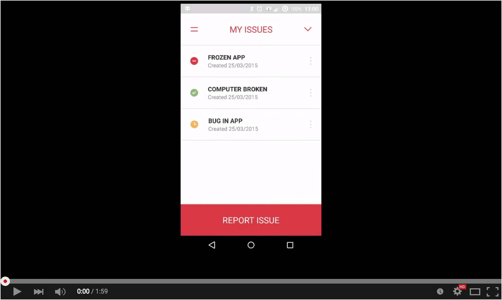

# Bank of Westeros

## Introduction

The *Bank of Westeros* application is an example application built with Liferay Screens to manage technical issues in a bank. It allows new user registration with Liferay Portal, editing of existing user details, and editing of other portal content.

You can also download it using [Google Play](https://play.google.com/store/apps/details?id=com.liferay.mobile.screens.bankofwesteros).

## Compatibility

- Android SDK 4.0 (API Level 14) and above

## Features

The Bank of Westeros app currently showcases the following screenlets:

- [`LoginScreenlet`](../../documentation/LoginScreenlet.md): Allows users to log in to Liferay Portal. The app uses a custom `LoginScreenlet` (an [extended view](../../documentation/view_creation.md#extended-view) that adds a button to show the password characters in plain text.
- [`SignUpScreenlet`](../../documentation/SignUpScreenlet.md): Allows new users to sign up with the Westeros Bank portal. The app uses a custom `SignUpScreenlet` (an example of creating a [full view](../../documentation/view_creation.md#full-view)) to add a new interactor.
- [`ForgotPasswordScreenlet`](../../documentation/ForgotPasswordScreenlet.md): Sends an email to the user if they've forgotten their password.
- [`DDLListScreenlet`](../../documentation/DDLListScreenlet.md): Lists all open issues in the portal. This uses a custom list adapter to show the issues' creation dates, custom drawables, and custom actions.
- [`DLLFormScreenlet`](../../documentation/DDLFormScreenlet.md): Allows creation of new issues, and editing of existing issues. This uses a custom view for the *select field* to alter the behavior when showing the field label.
- [`UserPortraitScrenlet`](../../documentation/UserPortraitScreenlet.md): Shows the user's portrait from the portal, using an [extended view](../../documentation/view_creation.md#extended-view) to change the border color and width.
