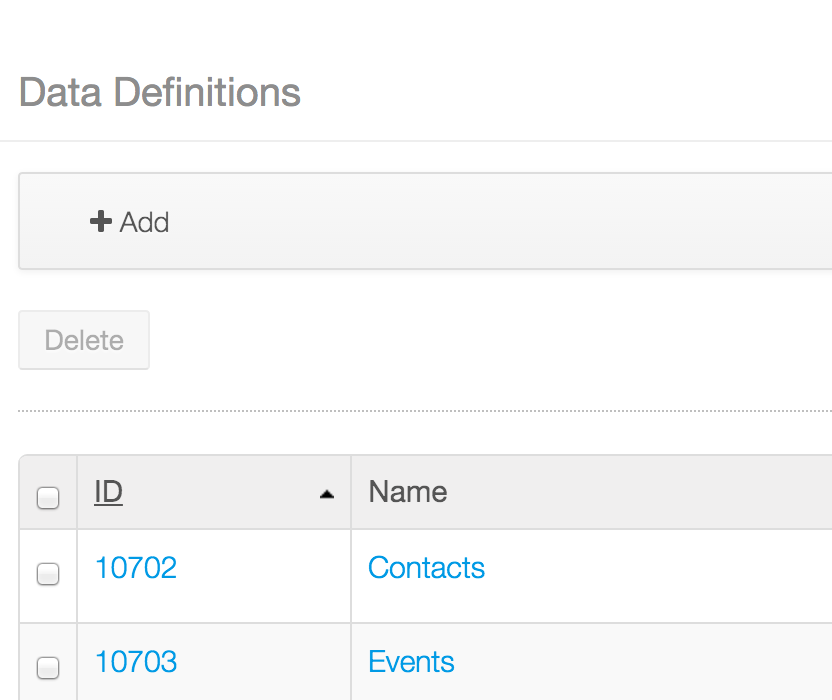

# DDLForm for iOS

## Important Note

_This product is under heavy development and its features aren't ready for use in production. It's being made public only to allow developers to preview the technology._

## Features
- Shows a collection of fields in order to allow user to fill their values.
- It may show initial values for the fields or the values of any existing record.
- Supports fields of the following data types:
	- Boolean: two states value typically shown using a checkbox.
	- Date: a formatted date value. The format will depend on current devices locale.
	- Decimal, Integer and Number: a numeric value.
	- Document and Media: a file (photo, video, etc.) stored in the device. It will be uploaded to an specific portal repository.
	- Radio: A set of options to choose one value from them. 
	- Select: A dropdown list of options to choose one value from them.
	- Text: a single line text.
	- Text Box: a multi line text.
- Stored records support an specific workflow.
- Submit button can be shown at the end of the form.
- Supports required values and validation. 
- Supports traverse the form fields from the keyboard
- Supports i18n in record values and labels.

## Actual limitations

- Doesn't support nested fields in the data definition.
- Doesn't support multiple selection on Radio and Select datatypes.

##Module
DDL

## Themes
- Default: uses a standard `UITableView` to show the scrolleable list of fields. Other themes may use a different component (`UICollectionView`, paginated form or whatever) to show the fields.

## Requirements

- XCode 6.0 or above
- iOS 8 SDK
- Liferay Portal 6.2 CE or EE
- Mobile Widgets plugin installed

## Compatiblity

- iOS 7 and above

## Portal configuration

Dynamic Data List and Data Types should be configured properly in the portal.
If workflow is required, it has to be also configured.

Refer to [Defining Data Types](https://www.liferay.com/documentation/liferay-portal/6.2/user-guide/-/ai/building-a-list-platform-in-liferay-and-liferay-portal-6-2-user-guide-10-en) and [Creating Data Lists](https://www.liferay.com/documentation/liferay-portal/6.2/user-guide/-/ai/creating-data-lists-liferay-portal-6-2-user-guide-10-en) and [Using workflow](https://www.liferay.com/documentation/liferay-portal/6.2/user-guide/-/ai/using-workflow-liferay-portal-6-2-user-guide-11-en) sections for more details.

## Attributes

| Attribute | Data type | Explanation |
|-----------|-----------|-------------| 
|  `structureId` | `number` | The identifier of the Dynamic Data Type (or Structure). You can find the identifier in the table of all lists: `Dynamic Data Lists - Manage Data Definitions`.  |
|  `groupId` | `number` | The site (group) identifier where the record will be stored. If this value is 0, the `groupId` specified in `LiferayServerContext` will be used|
|  `recordSetId` | `number` | The identifier of the Dynamic Data List (or Record Set). You can find the identifier in the table of all lists: `Site Administration - Content - Dynamic Data Lists`.  |
|  `recordId` | `number` | The identifier of the record if you want to show and edit its values. This identifier can be obtained from other methods or delegates |
|  `repositoryId` | `number` | The identifier of the repository to be used in Document and Media uploads. If this value is 0, the default repository for the site specified in `groupId` is used. |
|  `folderId` | `number` | The identifier of the folder where Document and Media files will be uploaded. If this value is 0, the root file will be used. |
|  `filePrefix` | `string` | The prefix to be used for Document and Media uplaoded files. After the prefix, a random GUID string will be appended. |
|  `autoLoad` | `boolean` | Whether or not the form will be loaded when the screenlet is shown. If `recordId` is set, the record value will be loaded together with the form definition |
|  `autoscrollOnValidation` | `boolean` | Whether or not the form will to the first failed field when validation is done. |
|  `showSubmitButton` | `boolean` | Whether or not the form will show a submit button at the bottom. If it's ´false´, the programmer should call `submitForm()` method. |

## Methods

| Method | Return | Explanation |
|-----------|-----------|-------------| 
|  `loadForm()` | `boolean` | Starts the request to load the form definition. When the response is received, the form fields are shown. Returns `true` if the request could be sent. |
|  `loadRecord()` | `boolean` | Starts the request to load the record specified in `recordId`. If needed, it will also load the form definition. When the response is received, the form fields are shown filled with record values. Returns `true` if the request could be sent. |
|  `submitForm()` | `boolean` | Starts the request to submit form values to the Dynamic Data List specified in `recordSetId`. If needed, it will also load the form definition. When the response is received, the form fields are shown filled with record values. Returns `true` if the request could be sent. |

## Delegate

This screenlet delegates some events in an object that conforms `DDLFormScreenletDelegate` protocol.
This protocol allows to implement the following methods:

- `onFormLoaded(record)`: called when the form is loaded. The `record` will contain only field definitions.
- `onFormLoadError(error)`: called when an error happened in the load of the form. The NSError object describes the error occurred.

- `onRecordLoaded(record)`: called when the form with values is loaded. The `record` will contain field definitions and values. Before this method, `onFormLoadResult` will be also called.
- `onRecordLoadError(error)`: called when an error happened in the load of a record. The NSError object describes the error occurred.

- `onFormSubmitted(record)`: called when the form values are successfully submited to the server.
- `onFormSubmitError(error)`: called when an error happened in the submit process. The NSError object describes the error occurred.

- `onDocumentUploadStarted(field)`: called when the upload of a Document and Media field starts.
- `onDocumentUploadedBytes(field, progress values)`: called when a block of bytes of a Document and Media field is uploaded. This method is intended to track progress of the uploads.
- `onDocumentUploadCompleted(field, attributes)`: called when a Document and Media field upload is completed.
- `onDocumentUploadError(error)`: called when an error happened in the process. The NSError object describes the error occurred.

    
    
