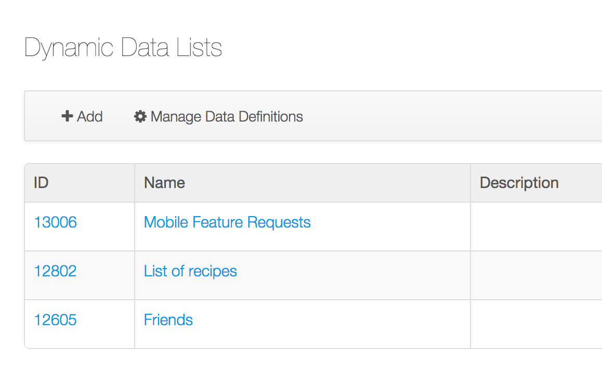
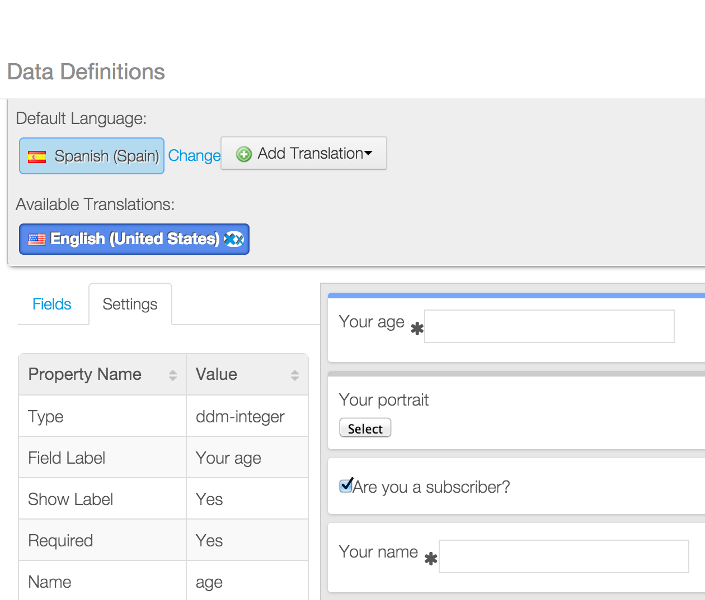

# DDLListWidget for iOS

## Important note
__This product is under heavy development and most of the features aren't ready to be used in production.
It's public, following our Open Source philosophy, in order to allow developers to preview the technology and contribute with feedback, ideas and bug fixes.__

## Features
- Shows a collection of DDL records in a scrolleable way
- Implements [fluent pagination](http://www.iosnomad.com/blog/2014/4/21/fluent-pagination) with configurable page size.
- Allow to filter records by creator user.
- Supports i18n in record values.

##Module
DDL

## Themes
- Default: uses a standard `UITableView` to show the scrolleable list. Other themes may use a different component (`UICollectionView` or whatever) to show the items.

## Requirements

- XCode 6.0 or above
- iOS 8 SDK
- Liferay Portal 6.2 CE or EE
- Mobile Widgets plugin installed

## Compatiblity

- iOS 7 and above

## Portal configuration

Dynamic Data List and Data Types should be configured properly in the portal.

Refer to [Defining Data Types](https://www.liferay.com/documentation/liferay-portal/6.2/user-guide/-/ai/building-a-list-platform-in-liferay-and-liferay-portal-6-2-user-guide-10-en) and [Creating Data Lists](https://www.liferay.com/documentation/liferay-portal/6.2/user-guide/-/ai/creating-data-lists-liferay-portal-6-2-user-guide-10-en) sections for more details.

## Attributes

| Attribute | Data type | Explanation |
|-----------|-----------|-------------| 
|  `recordSetId` | `number` | The identifier of the Dynamic Data List (or Record Set). You can find the identifier in the table of all lists: `Site Administration - Content - Dynamic Data Lists`.  |
|  `userId` | `number` | The user identifier to filter the records. Records won't be filtered if `userId` is 0|
|  `labelField` | `string` | The name of the field to be shown in the list. Refer to the list's data definition to find the field names: `Dynamic Data Lists - Manage Data Definitions`.  |

## Methods

| Method | Return | Explanation |
|-----------|-----------|-------------| 
|  `loadList()` | `boolean` | Starts the request to load the list of records. When the response is received, the list is shown. Returns `true` if the request could be sent. |

## Delegate

This widget delegates some events in an object that conforms `DDLListWidgetDelegate` protocol.
This protocol allows to implement the following methods:

- `onDDLListResponse(list of records)`: called when a page of contents is received. Note this method may be called more than once, one for each page retrieved.
- `onDDLListError(error)`: called when an error happened in the process. The NSError object describes the error occurred.
- `onDDLRecordSelected(record)`: called when an item in the list is selected. The parameter is an instance of the class `DLLRecord`.

    
    
