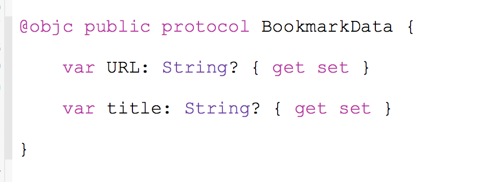

# Creating Screenlets in Liferay Screens for iOS

## Important Note

*This product is under heavy development and its features aren't ready for use in production. It's being made public only to allow developers to preview the technology*.

## Introduction

This document explains the steps required to create your own screenlet. Before proceeding, you may want to read the [Architecture Guide](architecture.md) in order to understand the underlying concepts. You may also want to read the guide [How to Create Your Own Theme](theme_creation.md) in order to support the new screenlet from the Default or other themes.

The steps below walk you through creating an example screenlet for bookmarks that has the following features:

- Allows entry of a URL in a text box.
- Checks if the URL is valid and extract its title value. 
- Shows a preview image and title for user confirmation.
- Allows the user to modify the title.
- Upon user confirmation, the URL and title is sent back to the Liferay instance's Bookmark services to be saved.

Steps:

1. Create a new `xib` called `BookmarkView_default.xib`. You'll build your UI here using Interface Builder. Put in two text box fields (`UITextField`) for the URL and title. Also, add a couple of buttons to let the user retrieve the title and save the bookmark. To differentiate between these two user actions, assign a value for the `restorationIdentifier` property in each button.

    

2. Create a new interface (protocol) called `BookmarkData`. The associated attributes are `url` and `title`.

    

3. Create a new class called `BookmarkView_default` that extends `BaseScreenletView` and implements `BookmarkData`. It must wire all UI components and events from the `xib` using the standard `@IBOutlet` and `@IBAction`. Getters and setters from `BookmarkData` should, respectively, get and set the data from UI components. Also be sure to write any animations or front end code here.

4. Set `BookmarkView_default` as the custom class of your `BookmarkView_default.xib` file.

5. Create a class called `BookmarkScreenlet` that extends `BaseScreenlet`.

6. Optionally, you can add any `@IBInspectable` property to configure the behavior. For example, you could use a boolean property to configure whether or not user can save broken URLs.

7. Override the `onUserAction` method so that it receives both button actions. Use the `actionName` parameter to differentiate between the following actions:

    - Check: Occurs when the "Add bookmark" button is touched. 
    - Save: Occurs when the "Confirm" button is touched.

8. Write two operation classes that extend `ServerOperation`. Override the `doRun` method to perform the operation. Also override the `validateData` method to check if the data stored in `BookmarkData` is valid. These two operation classes are described here:

    - `GetSiteTitleOperation`: Retrieves content from start of the HTML to the `<title>` tag. This results in the title being extracted from the HTML.
    - `LiferaySaveBookmarkOperation`: Sends the URL and title to the Liferay instance's Bookmark services.

9. In the screenlet's `onUserAction` method, create and start these operations:

    - Check: Create and start `GetSiteTitleOperation`. The closure specified should get the retrieved title and set it to the associated `BookmarkData` using the `screenletView`. If the operation fails, show the error to the user.
    - Save: Get the URL and title from `BookmarkData` and create a `LiferaySaveBookmarkOperation` object with these values. Start the operation and set the closure to show the success or failure to the user.

