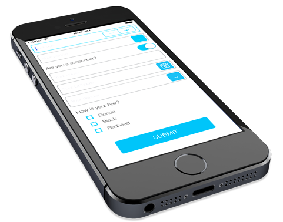
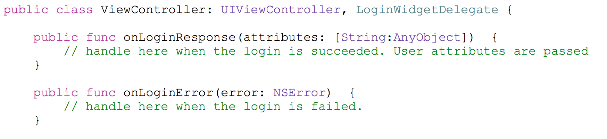

# Liferay Screens for iOS

## Important Note

*This product is under heavy development and its features aren't ready for use in production. It's being made public only to allow developers to preview the technology*.

## Introduction

The iOS implementation for Liferay Screens includes the components (*screenlets*) library and two sample projects. One sample project uses Screens from Objective-C, while the other uses Screens from Swift.

In Liferay Screens, a screenlet is a visual component that is connected to Liferay Portal's functionality. The screenlet is responsible for handling communication between the server and the UI. screenlets also implement all typical [human interface guidelines described by Apple](https://developer.apple.com/library/ios/documentation/userexperience/conceptual/mobilehig/).

Each screenlet is tied to one or more services exposed by [Liferay's remote services](https://www.liferay.com/documentation/liferay-portal/6.2/development/-/ai/accessing-services-remotely-liferay-portal-6-2-dev-guide-05-en). The screenlet then renders information using a theme. Themes can be contributed by third parties and are fully pluggable, so you're not limited to one specific look and feel. The Screens library provides a standard theme called *Default*  and another sample theme called *Flat7*.

Please note that themes provided in early versions support only vertical screen orientation and the iPhone 5, 5s, and 5c screen size. Support for the full range of screen orientations and sizes will be added in the future.

To learn more detail about the architecture of Screens, please see the [library documentation page](https://github.com/liferay/liferay-screens/tree/master/ios/Library/README.md).

## Requirements

Development of iOS apps using Liferay Screens requires the following: 

  - Xcode 6.1 or above
  - iOS 8 SDK
  - [CocoaPods](http://cocoapods.org) installed
  - [Liferay Portal 6.2 CE or EE](http://www.liferay.com/downloads/liferay-portal/available-releases)
  - [Liferay Screens' compatiblity plugin](https://github.com/liferay/liferay-screens/tree/master/portal). 
  - Liferay Screens source code

Your iOS app can we written in Swift or Objective-C.

## Compatibility

This implementation of Liferay Screens uses the Swift programming language. However, it doesn't use the new iOS 8 APIs, so it can be run only on devices with iOS 7 and above.

## Preparing Your Project for Liferay Screens

Liferay Screens is released as a plain source code library. As soon as CocoaPods supports Swift libraries ([1](https://github.com/CocoaPods/CocoaPods/pull/2222), [2](https://github.com/CocoaPods/CocoaPods/issues/2272)), you'll be able to set up your project by simply adding a single line to your `Podfile`. 

Meanwhile, there are a few things you need to manually setup in your app to prepare it for Liferay Screens. First, you need to download the [Liferay Screens source code](https://github.com/liferay/liferay-screens/archive/master.zip) and add it to your project. The steps for doing this are shown here:

1. Create a folder at the root of the project called `Liferay-Screens`.
2. Copy the folders `Library/Source` and `Library/Themes` from the downloaded 
   source code into this new folder.
3. Drag `Liferay-Screens` from the Finder and drop it into your Xcode project.

Next, set up [CocoaPods](http://cocoapods.org) for your project if you haven't done so already. Add the dependencies to your `Podfile` and then execute `pod install`. Use this [Podfile](https://github.com/liferay/liferay-screens/tree/master/ios/Library/Podfile) as a template. You should consider using the [CocoaPods for Xcode plugin](https://github.com/kattrali/cocoapods-xcode-plugin). You can install it through the [Alcatraz package manager](http://alcatraz.io/)) for Xcode. This way, you can perform these tasks from Xcode.

In your project's build settings, you also need to edit the *Objective-C Bridging* Header to include `${SRCROOT}/Liferay-Screens/Source/liferay-screens-bridge.h`. This is shown in the following screenshot:

There's just one more thing to take care of to ensure that your project is ready for Liferay Screens. Create a new property list file called `liferay-server-context.plist`. You'll use this file to configure the settings for your Liferay Portal instance. Use [`liferay-server-context-sample.plist`](https://github.com/liferay/liferay-screens/tree/master/ios/Library/Source/liferay-server-context-sample.plist) as a template. This screenshot shows such a file being browsed:

Great! Your project should now be ready for Liferay Screens. Next, you'll learn how to use screenlets in your project.

## Using Screenlets

Now you're ready to start using screenlets in your project. First, use Interface Builder to insert a new UIView in your Storyboard or XIB file. This is shown in the following screenshot:

Next, change the Custom Class to screenlet's class name. For example, if you're using `LoginScreenlet`, then enter that as the Custom Class name. This is shown here:

Now you need to conform the screenlet's delegate protocol in your `ViewController` class. For example, for the `LoginScreenlet` this is `LoginScreenletDelegate`.

Now that the screenlet's delegate protocol is conformed in your `ViewController` class, go back to Interface Builder and connect the screenlet's delegate to your view controller. If the screenlet you're using has more outlets, you can assign them as well.

*Note that there are [some issues](http://stackoverflow.com/questions/26180268/interface-builder-iboutlet-and-protocols-for-delegate-and-datasource-in-swift/26180481#26180481) connecting an outlet to Swift source code. You can change the delegate data type or just assign the outlets by code.*

Awesome! Now you know how to use screenlets in your projects. However, if you want to use screenlets from Objective-C code, there are a few more things that you need to take care of. These are presented in the next section. If you don't need to use screenlets from Objective-C, you can skip this section and proceed to the list of available screenlets below.

### Using Screenlets from Objective-C Code

If you want to invoke screenlet classes from your Objective-C code, then there are a couple of additional header files that you need to import. Their import statements are shown here:

    #import "liferay-screens-bridge.h"
    #import "[name_of_your_project]-Swift.h"
    
Simply replace `name_of_your_project` with your project's name. If your project's name uses non-alphanumeric characters, replace them with `_`. If you get tired of adding the same imports over and over again, you can add a precompiler header file using the following steps:

1. Create the file `Prefix.pch` and add it to your project.

2. Add the previous imports to that file.

3. Edit the following build settings of your target, using the indicated settings. Remember to replace `path/to/your/file/` with the path to your `Prefix.pch` file:

    - Precompile Prefix Header: `Yes`
    - Prefix Header: `path/to/your/file/Prefix.pch`

    

Super! Now you know how to call screenlets from the Objective-C code in your project. Next, a list of the screenlets available in Liferay Screens is presented.

## Listing of Available Screenlets

Screenlets are grouped in modules based on internal dependencies. Each module is isolated, so you can use only the modules that are necessary for your project. However, it's important to note that you can't use a screenlet from a single module without using the entire module. The screenlets here are listed according to the module that they belong to.

- **Auth**: Module for user authentication. It uses the [user management](https://dev.liferay.com/discover/portal/-/knowledge_base/6-2/user-management) features of Liferay Portal. It includes the following screenlets:

	- [`LoginScreenlet`](Documentation/LoginScreenlet.md): Gives your app the ability to sign users in to a Liferay instance.
	- [`SignUpScreenlet`](Documentation/SignUpScreenlet.md): Gives your app the ability to sign new users in to a Liferay instance.
	- [`ForgotPasswordScreenlet`](Documentation/ForgotPasswordScreenlet.md): Gives your app the ability to send emails containing a new password or password reset link to users.

- **Dynamic Data Lists (DDL)**: Module for interacting with [Dynamic Data Lists](https://dev.liferay.com/discover/portal/-/knowledge_base/6-2/using-web-forms-and-dynamic-data-lists) in a Liferay instance. It includes the following screenlet:

	- [`DDLFormScreenlet`](Documentation/DDLFormScreenlet.md): Gives your app the ability to present dynamic forms to be filled by users and submitted back to the server.
	- [`DDLListScreenlet`](Documentation/DDLListScreenlet.md): Gives your app the ability to show a list of records based on a pre-existing DDL in a Liferay instance.

Also, some screenlets can be used individually without the need to import an entire module. These include:

- [`AssetListScreenlet`](Documentation/AssetListScreenlet.md): Shows a list of assets managed by [Liferay's Asset Framework](https://www.liferay.com/documentation/liferay-portal/6.2/development/-/ai/asset-framework-liferay-portal-6-2-dev-guide-06-en). This includes web content, blog entries, documents, and more.
- [`WebContentDisplayScreenlet`](Documentation/WebContentDisplayScreenlet.md): Shows the HTML of web content. This screenlet uses the features avaiable in [Web Content Management](https://dev.liferay.com/discover/portal/-/knowledge_base/6-2/web-content-management).

## Listing of Available Themes

With themes, you can control the look and feel of any screenlet that you decide to use in you app. What's more, these themes are fully pluggable. You can install new themes to extend and customize any screenlet to meet the design (UI) and usability (UX) of your app.

The themes currently released with Liferay Screens are:

- **Default**: The standard theme that is used when you insert any screenlet on your screen. It can be used as the parent theme for any of your custom themes (refer to the [Architecture Guide](Documentation/architecture.md#theme-layer) for more details on this).
- **Flat7**: A sample theme intended to demonstrate how to develop your own full theme from scratch. For information on creating your own theme, refer to the [Theme Guide](Documentation/themes.md).

## Sample apps
You can also check out the [Showcase app](Samples/README.md) in order to learn how to configure and use the screenlets available.

## Contributing New Screenlets and Themes

If you have a piece of code that can be reused in other apps, you may want to contribute it to the Liferay Screens project. Doing so is very straightforward: just follow the instructions in the [Contributors Guide](https://github.com/liferay/liferay-screens/tree/master/CONTRIBUTING.md).

