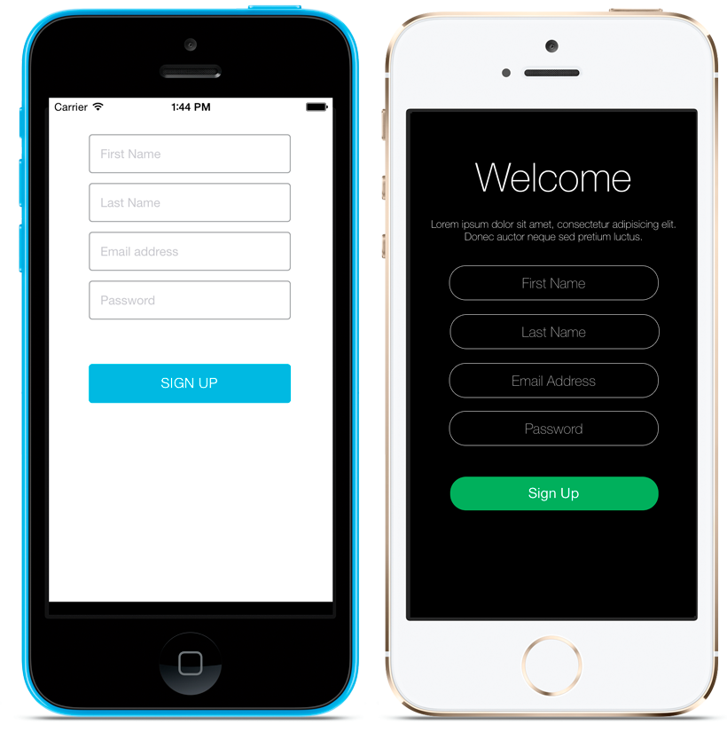
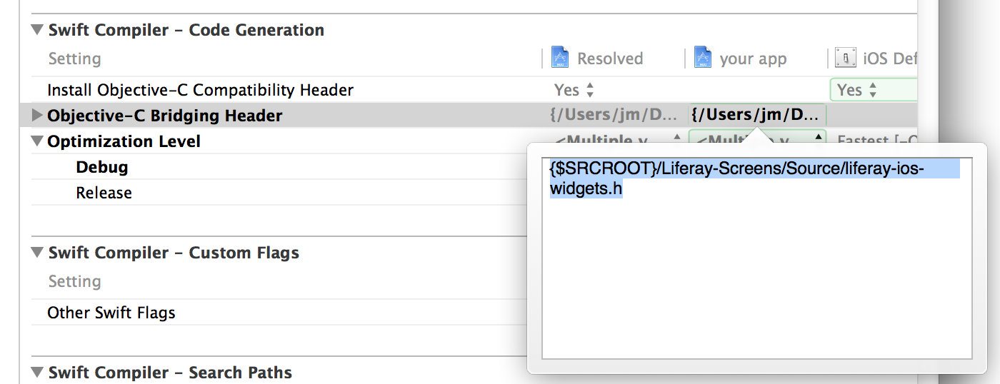
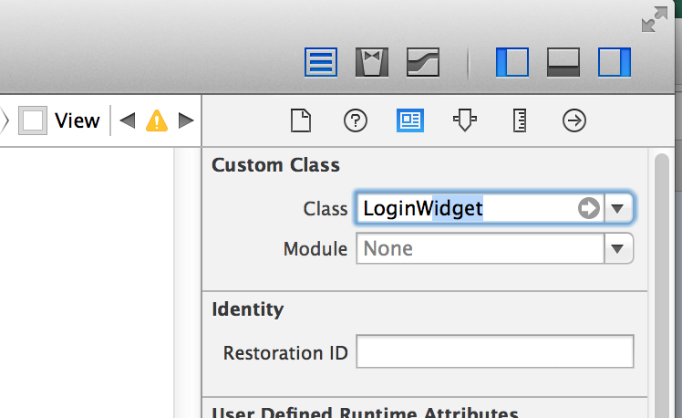

# Liferay Screens for iOS

## Important note
__This product is under heavy development and most of the features aren't ready to be used in production.
It's public just in order to allow developers to preview the technology.__

## Introduction
This is the iOS implementation for Liferay Screens.

It includes the widgets library and two sample projects: one to use Screens from Objective-C and another from Swift.

In Liferay Screens, we call "widget" to a visual component connected to Liferay's portal funcionallity. It's responsible of communicating with the server (Liferay Portal), and to get/show the information from/to the UI. Widgets also implements all typical [human interface guideliness described by Apple](https://developer.apple.com/library/ios/documentation/userexperience/conceptual/mobilehig/).

Each widget is tied to one or more service exposed by [Liferay's remote services](https://www.liferay.com/documentation/liferay-portal/6.2/development/-/ai/accessing-services-remotely-liferay-portal-6-2-dev-guide-05-en), and renders the information using one component called "theme". Themes can be contributed be third parties and are 100% plugable, so you're not limited to one specific look and feel.
Screens library provides one standard theme called "Default" and another sample one called "Flat7"

Notice that themes provided in early versions supports only iPhone 5 and vertical resolution, but they will eventually support the wide range of screens and resolutions.

For more details of the internal architecture, check the [library documentation page](https://github.com/liferay/liferay-screens/tree/master/ios/Library/README.md)

## Compatibility 
This implementation uses Swift language, but doesn't use new iOS 8 APIs, so it can be run in any device with iOS 7 and above.

## How to prepare your project to use Liferay Screens

We are assuming that you have an XCode project already configured and have basic knowledge of iOS development.

Notice these steps are the manual way to install Liferay Screens in your project. As soon as CocoaPods supports Swift libraries, it will be as easy as add one new line to your `Podfile`

1. Download [Liferay Screens's source code](https://github.com/liferay/liferay-screens/archive/master.zip) and add it to your project:
	1. Create a folder at the root of the project called `Liferay-Screens`.
	1. Copy folders `Library/Source` and `Library/Themes` from the downloaded source code into this new folder.
	1. Drag `Liferay-Screens` from the Finder and drop it into your XCode project.

	

1. If you didn't do it yet, set up [CocoaPods](http://cocoapods.org) for your project
1. Add depencendies to your `Podfile` and execute `pod install`. Use this [`Podfile`](https://github.com/liferay/liferay-screens/tree/master/ios/Library/Podfile) as a template.
1. Edit the following Builder Settings in your project's configuration:
    - Objective-C Bridging Header: `${SRCROOT}/Liferay-Screens/Source/liferay-ios-widgets.h`

	

1. Create a new file of type Property List called `liferay-server-context.plist` to configure the settings for your Liferay Portal (like the URL to the server). Use [`liferay-server-context-sample.plist`](https://github.com/liferay/liferay-screens/tree/master/ios/Library/Source/liferay-server-context-sample.plist) as a template.

	

## How to use a widget in your project

1. Using Interface Builder, insert a new UIView in your Storyboard or XIB file.

	

1. Change the Custom Class to widget's class name. For example: `LoginWidget`.

	

1. In your ViewController class conform widget's delegate protocol in your view controller. For example: `LoginWidgetDelegate`

1. Go back to Interface Builder and set widget's delegate to your view controller. If the specific widget has more outlets, you may assign them too.

#### Additional steps for Objective-C code

In order to invoke widget classes from your Objective-C code, import the following header files:

    #import "liferay-ios-widgets.h"
    #import "[name_of_your_project]-Swift.h"
    
If your project's name uses non-alphanumeric characters, replace them by _

And if you get bored of adding the same imports over and over again, you may add a precompiler header file following these steps (optional):

1. Create and add to your project the file `Prefix.pch`
1. Add previous imports to that file
1. Edit Build Settings of you target
    - Precompile Prefix Header: Yes
    - Prefix Header: path\_to\_your\_file\_Prefix.pch

## How to contribute new widgets

Would you like to contribute new widgets? Awesome :)

It's so simple: just follow our [contributors guide](https://github.com/liferay/liferay-screens/tree/master/CONTRIBUTING.md)
