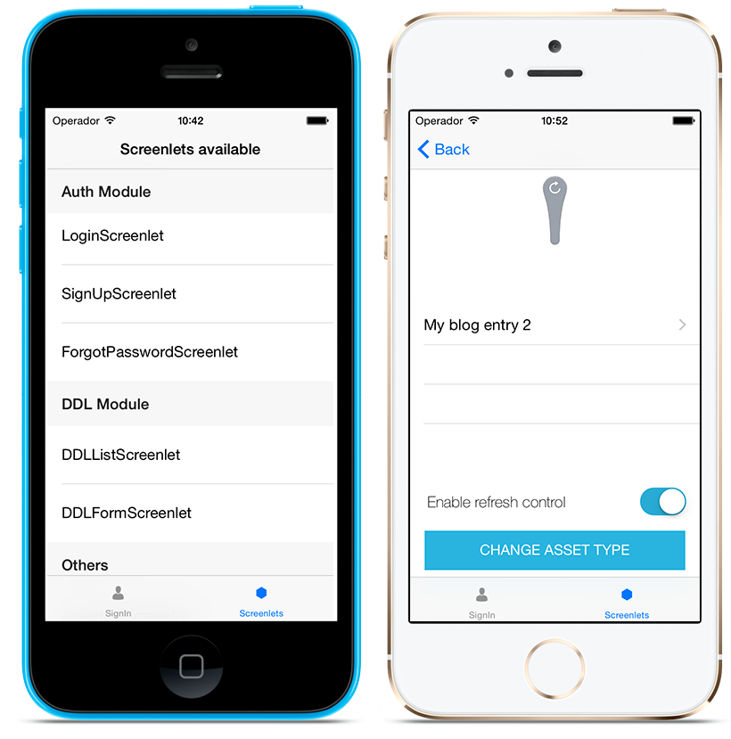
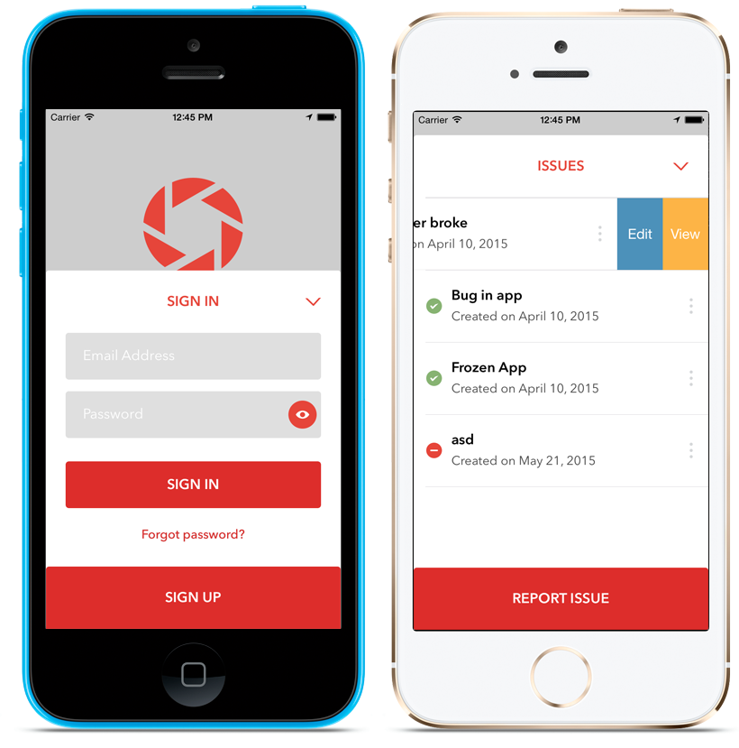

# Liferay Screens Samples for iOS

## Introduction

This directory contains sample apps to show you how to use Liferay Screens in your projects. Most examples are provided in both Objective-C and Swift.

## The Showcase App

The Showcase app uses all available screenlets so you can see how to use them in your apps. The Showcase app also lets you change some configuration parameters to modify the app's behavior. Both Objective-C and Swift source code are provided.

## The Westeros Bank App

The Westeros Bank app is a real example using some screenlets to manage technical issues for the *Westeros Bank*. In this sample you'll learn how to use screenlets in a real-world app, and how to extend and customize standard screenlets and viewsets to meet your design requirements.

